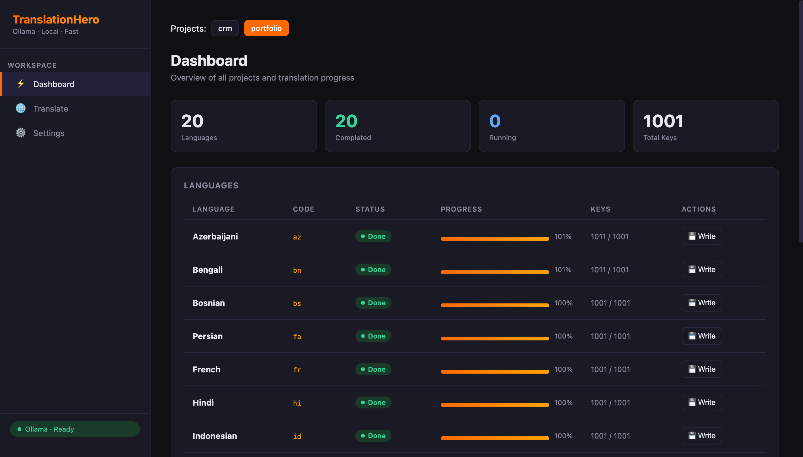

# Ollama Translation Hero

Local translation tool powered by Ollama. Batch-translates all keys from a master language file into multiple target languages, preserving file structure.



## Quick Start

```bash
pip install -r requirements.txt
python run.py
# Opens at http://127.0.0.1:7979
```

## Features

- **Batch translation** — sends 25 keys at a time to Ollama (avoids context limits)
- **Resume** — picks up where it left off if interrupted
- **Progress tracking** — per-language state saved to `data/input/<project>/states/<language>.json`
- **Multi-format** — parses and writes `.ts`, `.js`, `.json`, `.py` files
- **Multi-project** — just create a new folder under `data/input/`
- **Web UI** — dashboard, per-language controls, settings editor
- **Configurable** — change master lang, Ollama URL, model, batch size via UI

## Project Structure

```
ollama-translation-hero/
├── run.py                         # Entry point
├── requirements.txt
├── src/
│   ├── api.py                     # FastAPI backend
│   ├── parsers.py                 # File format parsers
│   ├── writer.py                  # Translated file writer
│   ├── translator.py              # Ollama API + batching
│   ├── state_manager.py           # Progress persistence
│   └── project_config.py          # Project discovery + config
├── ui/
│   └── index.html                 # Web UI (single file)
└── data/
    └── input/
        └── example/               # Your project
            ├── languages/         # Translation files
            │   ├── tr.ts          # Master (reference)
            │   ├── en.ts
            │   └── ...
            ├── project.json       # Project config (auto-created on first save)
            └── states/            # Progress state (auto-created)
                └── <language>.json
```

## Adding a New Project

1. Create `data/input/<your-project>/`
2. Put your language files in a subdirectory (e.g. `languages/`, `locales/`, `i18n/`)
3. Refresh the UI — it auto-detects the project

## Supported File Formats

| Format     | Extension | Notes                         |
| ---------- | --------- | ----------------------------- |
| TypeScript | `.ts`     | `export const lang = { ... }` |
| JavaScript | `.js`     | `export const lang = { ... }` |
| JSON       | `.json`   | Flat or nested                |
| Python     | `.py`     | `lang = { ... }` dict         |

System detects format and content structure automatically, preserving it in the output.
No need to specify anything except the master language file — just make sure all keys are present in it.

## Settings

All settings are configurable via the UI → Settings tab, or by editing `data/input/<project>/project.json`:

```json
{
  "master_lang": "en",
  "ollama_url": "http://localhost:11434",
  "model": "gpt-oss:20b",
  "batch_size": 25,
  "skip_langs": ["ar", "zh"]
}
```

## CLI Options

```bash
python run.py --port 8080        # Custom port
python run.py --host 0.0.0.0     # Expose on network
python run.py --reload           # Dev mode (auto-reload)
```
